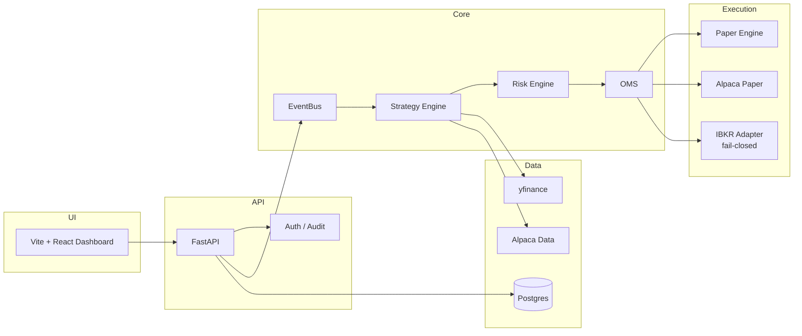

# QuantDesk

<p align="center">
  <strong>English</strong> · <a href="README.zh-CN.md">简体中文</a>
</p>

<p align="center">
  <strong>Minimal Personal US Equities Quant Desk</strong><br/>
  Research → Alpha Wash → Paper → Live-ready (fail-closed)<br/>
  <em>一人可跑通 · 假 alpha 硬淘汰 · 实盘默认硬锁</em>
</p>

<p align="center">
  <a href="https://github.com/leohux/quantdesk-oss/actions/workflows/ci.yml"></a>
  <a href="https://github.com/leohux/quantdesk-oss/releases/latest"></a>
  <a href="https://github.com/leohux/quantdesk-oss/stargazers"></a>
</p>

<p align="center">
  <a href="#quick-start"></a>
  <a href="LICENSE"></a>
  <a href="SECURITY.md"></a>
  <a href="docs/Architecture.md"></a>
  <a href="web/package.json"></a>
</p>

---

**QuantDesk** is a **minimal, solo-operator** open-source quant desk for US equities — small enough for one person to run end-to-end, without hedge-fund infrastructure. It does not just backtest; it tries to **kill fake alpha** before money is at risk:

| Stage | What you get |
|-------|----------------|
| **Research / Backtest** | VectorBT (+ pandas fallback), shared signal interface, walk-forward friendly |
| **Alpha Wash** | Hard gates: robustness → survivorship → point-in-time universe → reality costs → factor attribution |
| **Paper** | Alpaca paper broker, brackets / OCO, portfolio risk gates |
| **Live (IBKR)** | Gateway in private Docker network, readiness console, **fail-closed by default** |

> ⚠️ **Not financial advice.** Trading involves risk of loss. This software is provided as-is for research and education. Live submission stays locked until *you* deliberately unlock multiple independent gates.

---

## Product tour

<p align="center">
  
</p>

<details>
  <summary><strong>More screenshots — strategy lab and paper trading</strong></summary>
  <br />
  
  <br /><br />
  
</details>

> Screenshots show a paper-trading environment with illustrative account data. No live-broker credentials or private infrastructure are included.

---

## Why QuantDesk?

Most "quant dashboards" glue a chart to a broker SDK and call it done. QuantDesk is built around a few non-negotiables:

- **Alpha wash before capital** — programmatic gates reject overfit, survivorship bias, look-ahead universes, unrealistic costs, and beta dressed up as alpha (`research_reviewer/`, hard-gate scripts)
- **One strategy interface** — the same `generate_signals(close, params) → (entries, exits)` runs in backtest, paper, and live runners
- **Event-driven core** — `MarketData → Signal → Risk → Order → Fill` over an `EventBus`
- **Pluggable execution** — swap `Paper` / `Alpaca` / `IBKR` without rewriting strategies
- **Pre-trade risk** — every order passes `RiskEngine` before any broker; brackets / OCO on paper
- **Live is fail-closed** — UI clicks and normal API calls cannot place real orders by accident
- **Ops-ready** — Docker Compose, Postgres, Redis, Nginx sample, Telegram notifications

---

## Architecture



Deep dive: [`docs/Architecture.md`](docs/Architecture.md) · [`docs/EventFlow.md`](docs/EventFlow.md)

---

## Features

### Trading core
- Shared strategy ABC + code strategies (`core/strategy/`)
- Backtest engine with VectorBT / pandas (`core/backtest/`)
- Paper execution simulator + Alpaca paper client (brackets / OCO)
- IBKR live adapter with reconnect + status mapping (`core/execution/ibkr.py`)
- Live guard + OMS reconcile + audit JSONL (`core/trading/live_guard.py`, `live_oms_service.py`)

### Alpha wash / research gates
- Rule engine with stable reject codes: overfit, walk-forward fail, param instability, survivorship, PIT universe, reality costs, no independent alpha (`research_reviewer/research_gates.py`)
- Hard Gate 8–11 scripts: survivorship + WF → point-in-time S&P → reality/cost/concentration → factor attribution
- Strategy status registry archives failed “pretty backtests” so they cannot quietly re-enter live
- Optional LLM-assisted alpha miner + research reviewer agents (proposal only — still must pass gates)

### Product surfaces
- Dashboard / Strategy Lab / Backtest / Paper / **Live (LOCKED)** / Settings
- REST API (`/api/*`) + OpenAPI at `/docs`
- EventBus path: market data → signal → risk → order → fill

### Safety
- Multi-gate live unlock (`LIVE_TRADING_ENABLED` ∧ `LIVE_EXECUTION_ARMED` ∧ arming token ∧ admin)
- Symbol / side whitelist, hard notional & exposure caps
- Kill switch + structured audit log
- Secrets stay in `.env` (repo ships `.env.example` only)

---

## Quick Start

### 1) Clone & configure

```bash
git clone https://github.com/leohux/quantdesk-oss.git
cd quantdesk
cp .env.example .env
# REQUIRED: set ADMIN_PASSWORD=... (no insecure default)\n# fill ALPACA_* if you want paper trading; leave live locks as-is
```

### 2) Run with Docker (recommended)

```bash
docker compose up -d --build
# API: http://127.0.0.1:18080
# Docs: http://127.0.0.1:18080/docs
```

IB Gateway is behind a Compose **profile** and is **not** started by default:

```bash
# only when you actually have IBKR credentials + want paper gateway
docker compose --profile ibkr up -d
```

### 3) Or run locally

```bash
python -m venv .venv
source .venv/bin/activate          # Windows: .venv\Scripts\Activate.ps1
pip install -r requirements.txt
uvicorn api.main:app --reload --host 0.0.0.0 --port 8000

# another terminal
cd web && npm install && npm run dev
```

| Surface | URL |
|---------|-----|
| Frontend (dev) | `http://127.0.0.1:5173` |
| API | `http://127.0.0.1:8000` |
| OpenAPI | `http://127.0.0.1:8000/docs` |

---

## Live Trading (IBKR) — locked by design

```bash
IBKR_TRADING_MODE=paper
IBKR_GATEWAY_MODE=paper
IBKR_READ_ONLY=true
LIVE_TRADING_ENABLED=false
LIVE_EXECUTION_ARMED=false
```

| Mode | Submits real orders? |
|------|----------------------|
| Mock / Shadow | No |
| IBKR Paper + read-only | No |
| Live unlocked (all gates) | Yes — only then |

Read: [`docs/LiveTrading.md`](docs/LiveTrading.md) · [`SECURITY.md`](SECURITY.md)

---

## Repository layout

```
quantdesk/
├── api/                 # FastAPI app
├── core/                # EventBus, strategy, risk, execution, live guard
├── backtest/            # Backtest runners
├── execution/           # Broker helpers (Alpaca paper utilities)
├── strategies/          # Built-in example strategies
├── alpha_miner/         # LLM-assisted alpha proposal loop
├── news_trader/         # News-driven sidecar
├── agents/              # Research / post-mortem agents
├── web/                 # Vite + React + Tailwind dashboard
├── docs/                # Architecture, API, Paper, Live, Deploy
├── deploy/              # Nginx sample + deploy/backup scripts
├── tests/               # Safety & lock tests
├── docker-compose.yml
└── .env.example
```

---

## Documentation

| Doc | Topic |
|-----|--------|
| [Architecture](docs/Architecture.md) | Modules, principles, directory map |
| [Event Flow](docs/EventFlow.md) | EventBus lifecycle |
| [API](docs/API.md) | REST surface |
| [Paper Trading](docs/PaperTrading.md) | Alpaca paper path |
| [Live Trading](docs/LiveTrading.md) | IBKR fail-closed path |
| [Deployment](docs/Deployment.md) | Docker / Nginx |

---

## Tests

```bash
pip install -r requirements.txt
pytest tests/ -q
```

CI runs on every push / PR (see `.github/workflows/ci.yml`).

---

## Roadmap (community-friendly)

- [ ] More example strategies + notebook tutorials
- [x] Real product screenshots
- [ ] Short demo GIF
- [ ] Hardened Docker images (multi-stage, non-root)
- [ ] Plugin registry for community strategies
- [ ] Optional Prometheus dashboards (sample, no private runbooks)

PRs welcome — see [`CONTRIBUTING.md`](CONTRIBUTING.md).

Community: [`CODE_OF_CONDUCT.md`](CODE_OF_CONDUCT.md) · [`CHANGELOG.md`](CHANGELOG.md) · [Issues](https://github.com/leohux/quantdesk-oss/issues)

---

## Disclaimer

This project is **not** a broker, CTA, or investment adviser. Past backtest performance does not imply future results. You are solely responsible for any capital you deploy. Keep live locks engaged until you understand every gate.

---

## License

[MIT](LICENSE) © QuantDesk contributors
