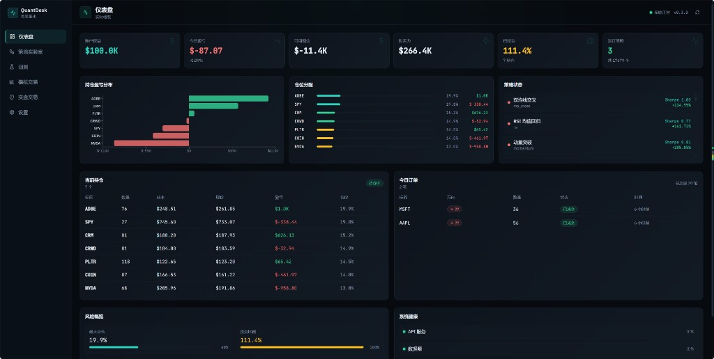
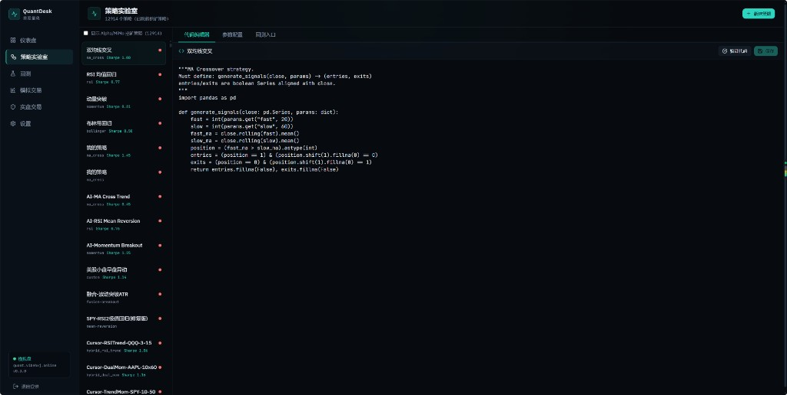
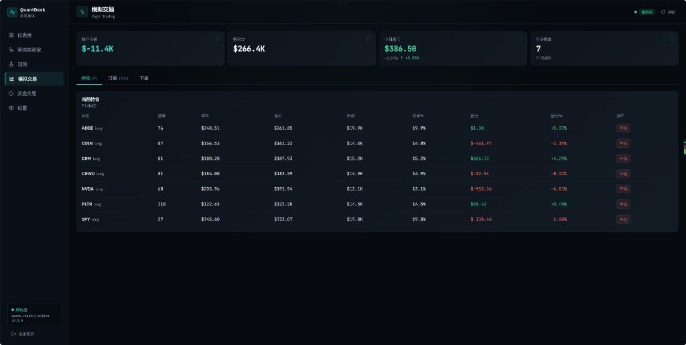
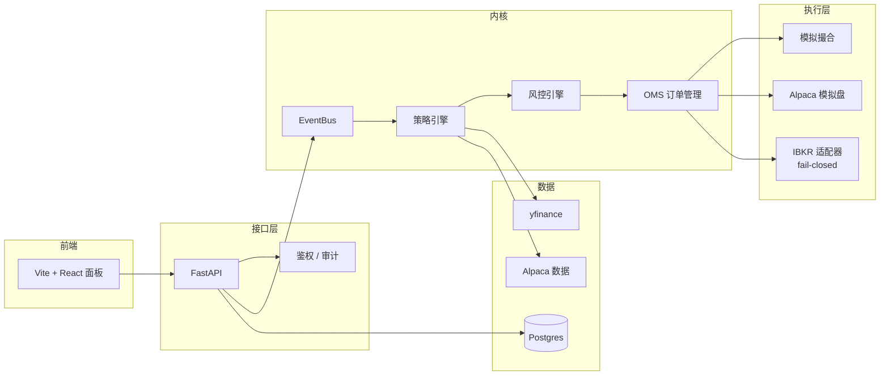

# QuantDesk

<p align="center">
  <a href="README.md">English</a> · <strong>简体中文</strong>
</p>

<p align="center">
  <strong>个人可做的最小美股量化台</strong><br/>
  研究 → 假 Alpha 淘汰 → 模拟盘 → 实盘就绪（默认硬锁）<br/>
  <em>一人可跑通 · Alpha Wash · 实盘默认 fail-closed</em>
</p>

<p align="center">
<a href="https://github.com/leohux/quantdesk-oss/releases/latest"></a>
  <a href="https://github.com/leohux/quantdesk-oss/stargazers"></a>
</p>

<p align="center">
  <a href="#快速开始"></a>
  <a href="LICENSE"></a>
  <a href="SECURITY.md"></a>
  <a href="docs/Architecture.md"></a>
  <a href="web/package.json"></a>
</p>

---

> **公开去敏版（`quantdesk-oss`）。** 不含密钥、实盘 journal、私有研究产物。请复制 `.env.example` → `.env`，设置强密码 `ADMIN_PASSWORD` 后再启动。

**获取方式**
1. **克隆：** `git clone https://github.com/leohux/quantdesk-oss.git`
2. **下载安装包：** 右侧 **Releases** → [最新 Release](https://github.com/leohux/quantdesk-oss/releases/latest) 的 Source code (zip / tar.gz)

**QuantDesk** 是一个**个人可落地的最小实现**开源美股量化台——一人就能跑通研究→模拟→实盘链路，不需要对冲基金级基建。它不只会回测，还会在动真钱之前**硬淘汰假 alpha**：

| 阶段 | 你能得到什么 |
|------|--------------|
| **研究 / 回测** | VectorBT（带 pandas 回退）、统一信号接口、对 walk-forward 友好 |
| **Alpha Wash** | 硬闸门：稳健性 → 幸存者偏差 → 时点宇宙 → 现实成本 → 因子归因 |
| **模拟盘 Paper** | Alpaca 模拟券商、括号单 / OCO、组合级风控闸门 |
| **实盘 Live（IBKR）** | IB Gateway 跑在私有 Docker 网络内、就绪度控制台、**默认 fail-closed** |

> ⚠️ **非投资建议。** 交易有亏损风险。本软件按「原样」提供，仅用于研究与学习。实盘下单会一直保持锁定，直到**你自己**主动解开多重独立闸门。

---

## 产品实览

<p align="center">
  
</p>

<details>
  <summary><strong>查看更多截图：策略实验室与模拟交易</strong></summary>
  <br />
  
  <br /><br />
  
</details>

> 截图来自模拟交易环境，账户数据仅用于产品展示；不包含实盘券商凭据或私有基础设施信息。

---

## 为什么是 QuantDesk？

大多数「量化面板」只是把图表接上券商 SDK 就完事。QuantDesk 从设计之初就坚持几条底线：

- **先洗假 alpha 再谈资金** —— 程序化闸门淘汰过拟合、幸存者偏差、未来函数宇宙、不真实成本、以及披着 alpha 外衣的 beta（`research_reviewer/` + hard-gate 脚本）
- **单一策略接口** —— 同一个 `generate_signals(close, params) → (entries, exits)` 同时跑在回测、模拟盘和实盘
- **事件驱动内核** —— `行情 → 信号 → 风控 → 订单 → 成交` 全部走 `EventBus`
- **执行层可插拔** —— `Paper` / `Alpaca` / `IBKR` 随意切换，策略代码不用改
- **交易前风控** —— 每一笔订单都要先过 `RiskEngine`；模拟盘支持括号单 / OCO
- **实盘 fail-closed** —— UI 点击和普通 API 调用**绝不会**误触真实下单
- **生产就绪** —— Docker Compose、Postgres、Redis、Nginx 示例、Telegram 通知

---

## 架构



深入阅读：[`docs/Architecture.md`](docs/Architecture.md) · [`docs/EventFlow.md`](docs/EventFlow.md)

---

## 功能特性

### 交易内核
- 统一策略基类 + 代码策略（`core/strategy/`）
- VectorBT / pandas 双引擎回测（`core/backtest/`）
- 模拟撮合引擎 + Alpaca 模拟盘（括号单 / OCO）
- IBKR 实盘适配器，带重连与状态映射（`core/execution/ibkr.py`）
- 实盘守卫 + OMS 对账 + 审计 JSONL（`core/trading/live_guard.py`、`live_oms_service.py`）

### Alpha Wash / 研究闸门
- 规则引擎 + 稳定拒绝码：过拟合、walk-forward 失败、参数不稳、幸存者偏差、时点宇宙、现实成本、无独立 alpha（`research_reviewer/research_gates.py`）
- Hard Gate 8–11：幸存者 + WF → 时点 S&P → 成本/集中度 → 因子归因
- 策略状态登记：把“好看但假”的回测归档，防止悄悄回流实盘候选
- 可选 LLM Alpha 挖掘 + 研究复核 agents（只提案，仍必须过闸门）

### 产品界面
- Dashboard / 策略实验室 / Backtest / Paper / **Live（锁定）** / Settings
- REST API（`/api/*`）+ `/docs` 自带 OpenAPI
- EventBus：行情 → 信号 → 风控 → 订单 → 成交

### 安全设计
- 多闸门实盘解锁（`LIVE_TRADING_ENABLED` ∧ `LIVE_EXECUTION_ARMED` ∧ arming token ∧ admin 角色）
- 标的 / 方向白名单，名义金额与敞口硬上限
- Kill switch + 结构化审计日志
- 密钥只存在 `.env`（仓库只提供 `.env.example`）

---

## 快速开始

### 解压后双击打开（Windows）

1. 安装并打开 [Docker Desktop](https://www.docker.com/products/docker-desktop/)，等到图标变绿
2. 双击 **`打开QuantDesk.bat`**（或 `start.bat`）
3. 首次会下载镜像，完成后浏览器自动打开 http://127.0.0.1:18080
4. 关闭时双击 **`关闭QuantDesk.bat`**

更短的说明见根目录 `使用说明.txt`。脚本会在缺少 `.env` 时自动从 `.env.example` 复制（默认密码 `changeme1`，请改掉）。

### 别人下载后能直接用吗？

- **有前端：** React 控制台在 `web/`，Docker 构建时会打包进镜像，由 API 一起提供（打开 http://127.0.0.1:18080 就是带 UI 的）
- **需要最少配置：** 双击 `打开QuantDesk.bat`，或手动 `cp .env.example .env`（默认登录密码 `changeme1`，请改掉）；要模拟盘再填 Alpaca Key
- **推荐路径：** Release zip / git clone → 双击启动（或 `docker compose up -d --build`）
- **默认只起核心服务**（API+前端+Postgres+Redis）。新闻交易 / miner / 盘中 runner / IBKR 都在 profile 后面

### 1）克隆并配置

```bash
git clone https://github.com/leohux/quantdesk-oss.git
cd quantdesk-oss
cp .env.example .env
# 默认 ADMIN_PASSWORD=changeme1 —— 对公网暴露前请改掉
# 想跑模拟盘就填 ALPACA_*；实盘锁保持原样别动
```

### 2）用 Docker 运行（推荐）

```bash
docker compose up -d --build
# UI + API: http://127.0.0.1:18080
# 文档:     http://127.0.0.1:18080/docs
```

可选 sidecar：

```bash
docker compose --profile news up -d
docker compose --profile mine up -d
docker compose --profile intraday up -d
docker compose --profile ibkr up -d
```

### 3）或者本地运行

```bash
python -m venv .venv
source .venv/bin/activate          # Windows: .venv\Scripts\Activate.ps1
pip install -r requirements.txt
uvicorn api.main:app --reload --host 0.0.0.0 --port 8000

# 另开一个终端
cd web && npm install && npm run dev
```

| 界面 | 地址 |
|------|------|
| 前端（开发） | `http://127.0.0.1:5173` |
| API | `http://127.0.0.1:8000` |
| OpenAPI | `http://127.0.0.1:8000/docs` |

---

## 实盘交易（IBKR）—— 设计上就是锁死的

```bash
IBKR_TRADING_MODE=paper
IBKR_GATEWAY_MODE=paper
IBKR_READ_ONLY=true
LIVE_TRADING_ENABLED=false
LIVE_EXECUTION_ARMED=false
```

| 模式 | 会下真实订单吗？ |
|------|------------------|
| Mock / Shadow | 不会 |
| IBKR Paper + 只读 | 不会 |
| 全部闸门解锁的 Live | 会 —— 只有这时才会 |

详见：[`docs/LiveTrading.md`](docs/LiveTrading.md) · [`SECURITY.md`](SECURITY.md)

---

## 目录结构

```
quantdesk/
├── api/                 # FastAPI 应用
├── core/                # EventBus、策略、风控、执行、实盘守卫
├── backtest/            # 回测 runner
├── execution/           # 券商辅助（Alpaca 模拟盘工具）
├── strategies/          # 内置示例策略
├── alpha_miner/         # LLM 辅助的 alpha 提案循环
├── news_trader/         # 新闻驱动 sidecar
├── agents/              # 研究 / 复盘 agents
├── web/                 # Vite + React + Tailwind 面板
├── docs/                # 架构、API、模拟盘、实盘、部署
├── deploy/              # Nginx 示例 + 部署/备份脚本
├── tests/               # 安全与锁定测试
├── 打开QuantDesk.bat / start.bat   # 双击启动
├── 关闭QuantDesk.bat / stop.bat    # 双击关闭
├── 使用说明.txt
├── docker-compose.yml
└── .env.example
```

---

## 文档

| 文档 | 主题 |
|------|------|
| [Architecture](docs/Architecture.md) | 模块、设计原则、目录地图 |
| [Event Flow](docs/EventFlow.md) | EventBus 生命周期 |
| [API](docs/API.md) | REST 接口 |
| [Paper Trading](docs/PaperTrading.md) | Alpaca 模拟盘链路 |
| [Live Trading](docs/LiveTrading.md) | IBKR fail-closed 链路 |
| [Deployment](docs/Deployment.md) | Docker / Nginx |

---

## 测试

```bash
pip install -r requirements.txt
pytest tests/ -q
```

本地用 `pytest` 跑测试即可。

---

## 路线图（欢迎社区参与）

- [ ] 更多示例策略 + notebook 教程
- [x] 真实产品截图
- [ ] 短演示 GIF
- [ ] 更硬核的 Docker 镜像（多阶段、非 root）
- [ ] 社区策略插件注册表
- [ ] 可选的 Prometheus 面板（示例，不含私有运维手册）

欢迎提 PR —— 见 [`CONTRIBUTING.md`](CONTRIBUTING.md)。

社区文件：[`CODE_OF_CONDUCT.md`](CODE_OF_CONDUCT.md) · [`CHANGELOG.md`](CHANGELOG.md) · [Issues](https://github.com/leohux/quantdesk-oss/issues)

---

## 免责声明

本项目**不是**券商、CTA 或投资顾问。历史回测表现不代表未来收益。你对自己投入的任何资金负全部责任。在完全理解每一道闸门之前，请保持实盘锁定。

---

## 许可证

[MIT](LICENSE) © QuantDesk contributors
